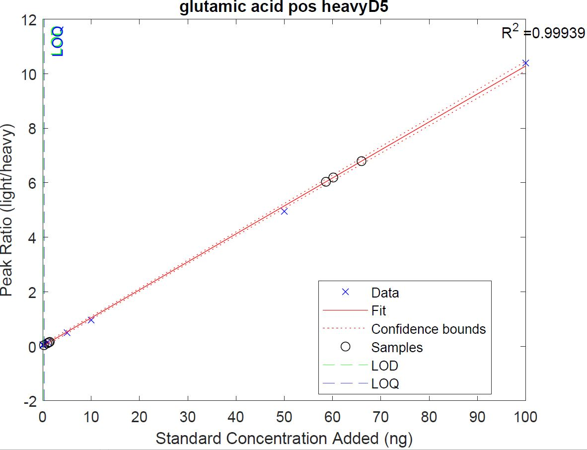

# Example Output Files
This document describes the expected output files for the full SkyMat code and is sorted into three subfolders: `C13`, `CombineAndSort`, and `D5`. Outputs found in subfolders `C13` and `D5` are generated from their respective riSkyline_${SILISType}.m scripts, whereas outputs in subfolder `CombineAndSort` are generated post-riSkyline_${SILISType}.m where outputs from riSkyline_${SILISType}.m are used as inputs for CombineAndSort.m. 

## C13
* SkyMat_testing_3isotopes.2024.01.10_C13.mat 
* SkyMat_testing_3isotopes_nM_concTable_C13.csv
* SkyMat_testing_3isotopes_nM_concTable_C13_filtered.csv
* neg_heavyC13_considerSkyline_flags.txt
* neg_heavyC13_mtabs_stdCurves.pdf
* pos_heavyC13_considerSkyline_flags.txt
* pos_heavyC13_mtabs_stdCurves.pdf
* temp_C13.mat

## D5
* SkyMat_testing_3isotopes.2024.01.10_D5.mat 
* SkyMat_testing_3isotopes_nM_concTable_D5.csv
* SkyMat_testing_3isotopes_nM_concTable_D5_filtered.csv
* neg_heavyD5_considerSkyline_flags.txt
* neg_heavyD5_mtabs_stdCurves.pdf
* pos_heavyD5_considerSkyline_flags.txt
* pos_heavyD5_mtabs_stdCurves.pdf
* temp_D5.mat

# Each file found in subfolders C13 and D5 can be broken down into the following output type 
* SkyMat_testing_3isotopes.2024.01.10_${SILISType}.mat - Output of MATLAB workspace variables at the end of the code.
  * ${SILISType} - `C13` or `D5`
* SkyMat_testing_3isotopes_${OutputConcentration}_concTable_${SILISType}_${FilteringUsed}.csv - Concentration table with metabolite name, LOD, LOQ, and metabolite concentrations for each sample. The `filtered` dataset replaces any value less than the LOD with NaN. Should you prefer to do your own filtering the raw unfiletered version is also provided. 
  * ${OutputConcentration} - `nM` (if input concentration was ng/mL or ng) or `pM` (if input concentration was pg/mL or pg).
  * ${SILISType} - `C13` or `D5`
  * ${FilteringUsed} - unfiltered (filename ends after SILISType) or `filtered` where values less than the LOD are replaced with `NAN`
* ${polarity}_heavy${SILISType}_considerSkyline_flags.txt - Flags generated due to sample concentrations exceeding the standard curve or missing confirm ions (listed with the percentage missing). 
  * ${polarity} - `pos` or `neg`
  * ${SILISType} - `C13` or `D5`
* ${polarity}_heavy${SILISType}_mtabs_stdCurves.pdf - Plot of a standard curve for each metabolite with R2 value of the linear regression displayed, standard concentrations shown as blue `x` and individual datapoints as black circles. The calculated LOD and LOQ are shown in green and blue dashed lines, respectively.
  * ${polarity} - `pos` or `neg`
  * ${SILISType} - `C13` or `D5`
 
* temp_${SILISType}.mat - temporary .mat file that saves prior to `MERGING DATA FROM TWO MODES` section, this can be used if errors occur during the data merging stage to recover your variables pre-merging without needing to re-run the script in its entirety. 
  * ${SILISType} - `C13` or `D5`

## CombineAndSort
* PredictionIntervals.pdf
  * PDF showing XXX. 
* SkyMat_testing_3isotopes_OneMode.mat
  * Output of MATLAB workspace variables at the end of the code.
