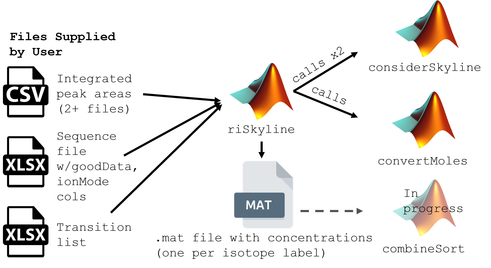

# SkyMat
The Kujawinski Lab uses a unique method for processing samples prepared by the [Widner et al. (2021)](https://doi-org.libproxy.mit.edu/10.1021/acs.analchem.0c03769) method. 
The method has gone through some upgrades (for example, double stable isotope labels) in the intervening years, but for anyone using the chemical method and peak-picking in Skyline, this is meant to be a set of codes that will get you from peak areas to concentrations, provided a standard curve. 

## How to use this repository.
Below, you will find a diagram of how to use these scripts in different applications of the method.

The main interface here will be `riSkyline.m`, and you should only use the version specific to the isotope label you're working with. If you have used both the 13C and the D5 internal standards, you'll use both versions here, which will generate two nearly-identical datasets. Ultimately, you will have _four_ standard curves this way (one per isotope and per ion mode), although only one ionization mode or isotope may be present for a given metabolite.

### Formatting the Sequence File
We will use a number of columns that are exported from a Thermo sequence file `.csv`; however, you will need to add a few columns to this so that the scripts can pair positive and negative-mode data. Add these columns to the sequence file and save it as an `.xlsx` file extension. Later, if you run into problems and need to use Excel's sorting and formatting functionalities, this will be useful.
* goodData: binary; SkyMat scripts will ignore sequence rows where goodData=0, such as column-conditioning injections
* ionMode: "pos" or "neg"
* sType: "blank", "rep" (samples), "std" (standard curve), "pool" (pooled QC samples)
* runOrder: numerical input showcasing the order your sequence was executed in
* _Optional_ sample data: could be species, or incubation time, or depth in the water column, or some experimental identifier.
  * Since this sequence file can be reloaded downstream, it can be used as a sort of master table for sample information that you draw from later. 
  * Note also that saving an `.xlsx` copy of your file means you can pare down the working file. Extraneous columns can be hidden or deleted if you like. 

An example of the first couple lines of a formatted sequence file might look like this (*italics* are default columns in the sequence file):
| *SampleType*   | *FileName*     | *SampleName*  | goodData | ionMode| sType | Nominal_Duration |
| :------------ |:--------------|:-------------|:---------|:-------|:------|:-----------------|
| Unknown       | mtab_Zoop2_BC_lumos_071423_004 | Zoop2_1_Std0 condition neg | 0 | neg | rep | |
| Std Bracket   | mtab_Zoop2_BC_lumos_071423_009 | Zoop2_1_std0 neg | 1 | neg | std| |
| Unknown       | mtab_Zoop2_BC_lumos_071423_028 | Zoop2_37_t12_Cpy_9 neg | 1 | neg | rep | 12 |

Note that while the default column names might contain spaces (e.g., "Sample Type"), the SkyMat scripts strip this whitespace during processing.
